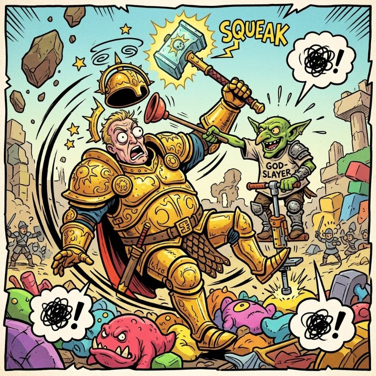
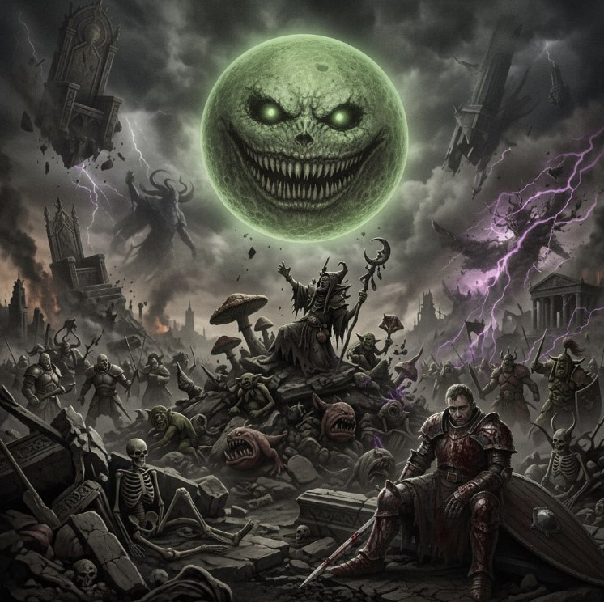

## Время начала и окончания каждого раунда

| Начало | Конец | Этап |
| :----: | :---: | :--: |
| 10:00 | 10:15 | Паринги и регистрация |
| 10:15 | 13:15 | 1 тур |
| 13:15 | 14:15 | Большой перерыв |
| 14:15 | 17:15 | 2 тур |
| 17:15 | 17:30 | Перерыв |
| 17:30 | 20:30 | 3 тур |
| 20:30 | 21:00 | Подведение итогов |

## Миссии турнира

- Раунд 1. **What's Yours Is Ours**
- Раунд 2. **Hidden Under Ash-Clouds**
- Раунд 3. **Curse of the Gnaw**

## Начисление очков

Подсчет очков происходит в боте [@RBWargameBot](https://t.me/RBWargameBot). Для этого необходимо до старта турнира пройти регистрацию, и в конце каждого тура подать результаты в бота.

В случае если армия одного из игроков полностью покрашена а его оппонента - нет, он можеn добавить 5 GW очков к своему финальному счету.

Победителем турнира станет игрок с наибольшим количеством побед. Не важно, мажорная это победа или минорная. Количество ничьих не имеет значения. При одинаковом количестве побед более высокое место займет игрок с большим количеством GW очков. Если и этот показатель будет равным, то победитель будет определен по силе оппонентов (то есть по сумме очков, набранных всеми оппонентами данного игрока).

Если в ходе партии у вас возникла спорная ситуация, обратитесь к судье, чтобы он принял решение.

## Cудья турнира

Илья, Социалистический Дракон.

## Спортивное поведение

Главное правило: будьте дружелюбны. Постарайтесь разрешать все споры ко взаимному удовольствию.

Пожалуйста, не подсказывайте игрокам во время их игры, даже если вы умеете лучше. Единственный повод вмешаться в игру — ситуация, когда вы видите явное нарушение правил. Например, если игрок делает больше атак, чем должен.

Читерство, использование несбалансированных кубиков, замедленная игра, злонамеренная нецензурная лексика и тому подобное недопустимы и приведут к снятию с турнира. Мы оставляем за собой право опубликовать имя читера и сообщить судьям других турниров.

В случае неявки к столу в обозначенное время будут применяться санкции.

## Требования к миниатюрам

Все модели должны удовлетворять требованию WYSIWYG. Если вы планируете использовать конверсии или альтернативные модели, то согласуйте их с судьей до начала турнира.

## Контроль времени

На каждую партию отводится три часа в соответствии с графиком турнира. Пожалуйста, хорошо выучите правила своей армии и будьте готовы играть достаточно быстро. По окончании времени на тур игроки должны доиграть текущий раунд, и сразу после этого партия останавливается. Дальнейшее доигрывание в перерывах вне расписания не допускается даже при обоюдном согласии игроков. Если вы не успеваете отыграть партию до конца за отведенное время, то убедитесь, что по крайней мере каждый из игроков сделал одинаковое количество ходов. Для этого не начинайте новый раунд, если до конца партии осталось менее получаса и вас нет твердой уверенности, что вы успеете закончить этот новый раунд вовремя.

Если исход партии очевиден (например, у одного игрока почти не осталось моделей), то постарайтесь обсудить устно, с каким счетом закончилась бы игра при наличии достаточного времени. В противном случае зафиксируйте тот счет, который получился по итогам тех раундов, которые вы успели отыграть полностью. В спорной ситуации позовите судью.

При желании вы можете использовать для контроля времени шахматные часы или альтернативные устройства. Если хотя бы один из игроков хочет играть с контролем времени, то игра проходит с шахматными часами (инициатор обязан предоставить устройство подсчета). Согласие второго игрока при этом не требуется. Обратите внимание, что игра с часами не обязательна. Для некоторых людей она является стрессовым фактором, который способен испортить удовольствие от турнира. Поэтому рекомендуем использовать часы только, когда это действительно необходимо.Каждый игрок должен сам следить за собственным временем и переключать часы по окончании своих действий. В том числе можно переключать часы на действия оппонента, производимые в ваш ход, например, на использование командной способности Redeploy.
В случае истечения времени одного из игроков, наступает так называемый «клокинг». В этом случае следует немедленно вызвать судью. Если судья подтверждает клокинг, то игрок, израсходовав своё время, может только, кидать спас-броски, варду, и убирать потери, а также начислять victory points за контроль точек, не имея права на другие действия.Время на игру начинается с броска на выбор стороны. Расстановка входит в личное время игрока. Все споры по правилам и ожидание судьи тратят время того игрока, который их инициировал.

