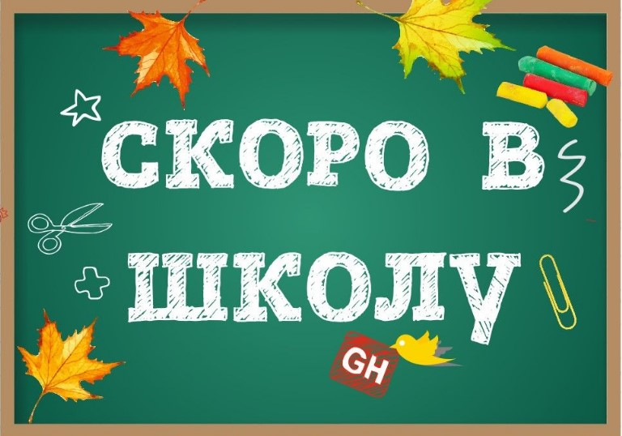

В Школу АОСа как вы могли понять. Турнир приуроченный к 1 сентября и сборам детей и себя к осени и новым знаниям.

Особенностью данного турнира будет условное деление игроков на Старшую, Среднюю и Младшую школу, а именно подгруппы для определения парингов. Если вы побеждаете, то переходите на ступень вверх, если проигрываете - на ступень вниз.  

Из-за ограничений по времени и количеству туров это не повлияет на обычную стандартную таблицу очков, но позволит вам обсудить как вы выросли или деградировали =)  
И так, начнем по-порядку:

Все игроки поделятся на 3 группы согласно своему развитию (ЭЛО), что приводит нас к тому что все будут играть с более-менее равными себе.  

После первого и второго туров случится редрафт групп - это покажет ваше текущее развитие и вы получите соответствующего оппонента.  
	
Победители же определяются по итоговому зачету набранных очков в турнире (стандартная схема).

Все получат праздничные призы к предстоящему учебному году и пусть никто не уйдет обиженным.

Дерзайте!

## Время и место

📅 Когда: 29 августа в 10:00
📍 Где: Клуб "Логово Дракона", г.Минск, ул. Кальварийская, 21/8
💰 Стоимость участия: 40 рублей

## Регламент

- Сдача ростеров до 22 августа включительно.  
- Заморозка правил по состоянию на 22 августа.
- Ростеры должны соответствовать актуальным правилам игры и собираются на 2000 pts.
- На турнире действует [Arrow City FAQ](https://docs.google.com/document/d/1R9EuaA4_wUCOkJaebiYF6yPKa2KN4ZBbT6eQfHjxmLs/edit?usp=sharing).
- Все опубликованные до даты сдачи ростеров FAQ должны приниматься во внимание
- Сдавать ростеры в Telegram [@ramonak90](https://t.me/ramonak90)

## Судьи
- Алексей
- Виталий
- Илья
- Роман

## Расписание турнира

| Начало  | Конец | Порядок телодвижений |
| :-----: | :---: | :------------------: |
| 10:00 | 10:15 | Паринги и регистрация |
| 10:15 | 13:15 | 1 тур |
| 13:15 | 14:15 | Большой перерыв |
| 14:15 | 17:15 | 2 тур |
| 17:15 | 17:30 | Перерыв |
| 17:30 | 20:30 | 3 тур |
| 20.30 | 21.00 | Подсчет очков и награждение |

## Миссии турнира

- 1 тур - Into the Fire  
- 2 тур - Curse the Gnaw  
- 3 тур - Escape from the Coast  
  
## Начисление очков

За партию можно получить до 20 турнирных очков, которые делятся между игроками следующим образом:

- ничья означает счет 10-10;
- минорная победа по тактикам(при равенстве очков) означает счет 11-9;
- победа с отрывом не более 5 очков — счет 12-8;
- победа с отрывом в 6-10 очков — счет 13-7;
- победа с отрывом в 11-15 очков  — счет 14-6;
- победа с отрывом в 16-20 очков  — счет 15-5;
- победа с отрывом в 21-25 очка  — счет 16-4;
- победа с отрывом в 26-30 очков — счет 17-3;
- победа с отрывом в 31-35 очка — счет 18-2;
- победа с отрывом в 36-40 очков — счет 19-1;
- разгром с отрывом 41 и более очков — счет 20-0. В случае равенства побеждает тот кто выполнил больше тактик.

  
